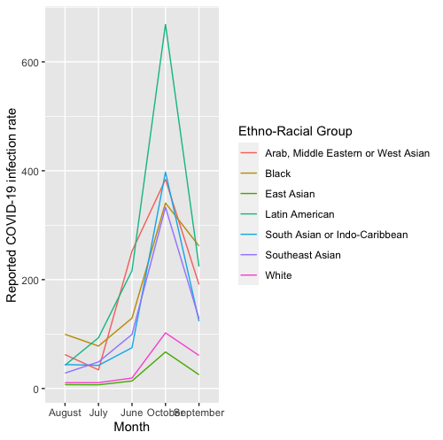
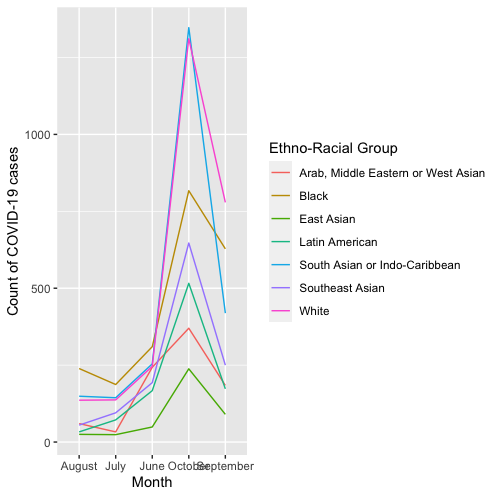
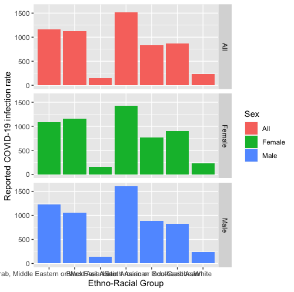
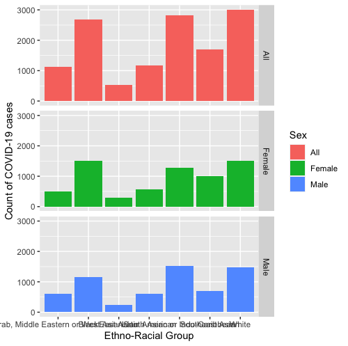
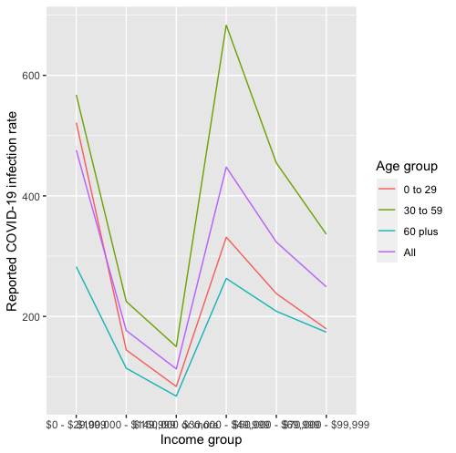
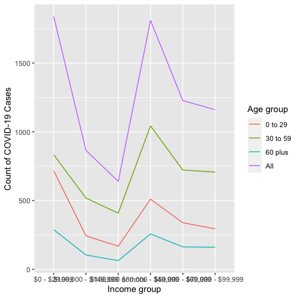
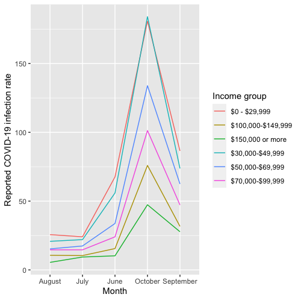
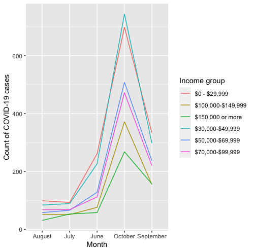

<!-- README.md is generated from README.Rmd. Please edit that file -->

```{r, include = FALSE}
knitr::opts_chunk$set(
  collapse = TRUE,
  comment = "#>",
  fig.path = "man/figures/README-",
  out.width = "100%"
)
```

# Covid19.labor

<!-- badges: start -->
<!-- badges: end -->
## Description

Covid19.labor is an R package to demonstrate components of a simple R package. This includes the main components: DESCRIPTION, NAMESPACE, man subdirectory and R subdirectory. Additionally, licence, README and subdirectories vignettes, tests, data and inst are also explored. The package is targeted for BCB410H students exploring development of an R package in bioinformatics.The goal of Covid19.labor is to display the patient  who has Covid19 by their Ethno-Racial Group, and their income levels by using the data that government gave.This will help to show which group of people have a larger chance getting effected.Whether it is by behavior, such as working environment, or  it is a generic problem, where there a gene that might effect individual have a higher chance to get effected. 

## Installation

You can install the released version of Covid19.labor from [CRAN](https://CRAN.R-project.org) with:

``` r
require("devtools")
devtools::installgithub("juliana-chu/Covid19.labor",buildvignettes = TRUE)
library("Covid19.labor")
```

To run the Shiny app:

``` r
runCovid19.labor()
```
## Overview

Covid19.labor contains 6 functions and a data set to demonstrate components of a simple R package. All functions plot a graph, by rate/percentage, time period, income/nation group.The data set is from City of Toronto, and I have imported them into 7 datasets. The runCovid19.labor is the function that launches the shiny app for this package. Refer to package vignettes for more details.

*plotERMonthlyCase* Display the distribution of nation by each month  in rate



*plotERMonthlyCase* Display the distribution of nation by each month in percentage


*plotERPopCase* Display the distribution of nation in rate


*plotERPopPer*Display the distribution of nation in percentage


*plotIncomeCase* Display the patient by their income in rate


*plotIncomePer* Display the patient by their income in percentage


*plotIncMonthyCase*Display the distribution of patient by each month income in rate


*plotIncMonthyPer*Display the distribution of patient by each month income in percentage


## Tutorials

```r
browseVignettes("Covid19.labor")

```

## Contributions

The author of the package is Juliana Chu. The ggplot package is used to produce plot visualizations. The R shiny package was used to create the Shiny app.

## Reference

Wickham, H. and Bryan, J. (2019). R Packages (2nd edition). Newton, Massachusetts: O’Reilly Media. https://r-pkgs.org/

R Core Team (2020). R: A language and environment for statistical computing. R Foundation for Statistical Computing, Vienna, Austria. https://www.R-project.org/

Marcelo Ponce, Amit Sandhel (2020). covid19.analytics: An R Package to Obtain, Analyze and Visualize Data from the Corona Virus Disease Pandemic. URL https://arxiv.org/abs/2009.01091

Pandey, P(2019).A Comprehensive Guide to Data Visualisation in R for Beginners. Retrieved October 27, 2020, from https://towardsdatascience.com/a-guide-to-data-visualisation-in-r-for-beginners- ef6d41a34174#e672

Government of Canada(n.d.). Canadian Economic Dashboard and COVID-19. Retrieved October 27, 2020, from https://www150.statcan.gc.ca/n1/pub/71-607-x/71-607-x2020009-eng.htm

Steipe, B. (2020). RPR-Coding Style. Retrieved October 04, 2020, from http://steipe.biochemistry. utoronto.ca/abc/index.php/RPR-Coding_style

City of Toronto.(2020).COVID-19: Status of Cases in Toronto.Retrivied December.10, 2020, from https://www.toronto.ca/home/covid-19/covid-19-latest-city-of-toronto-news/covid-19-status-of-cases-in-toronto/

## Acknowledge

This package was developed as part of an assessment for 2020BCB410H: Applied Bioinformatics, University of Toronto, Toronto,CANADA.
